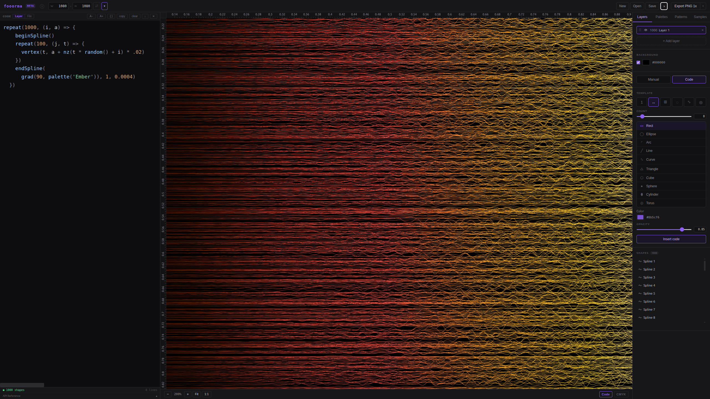
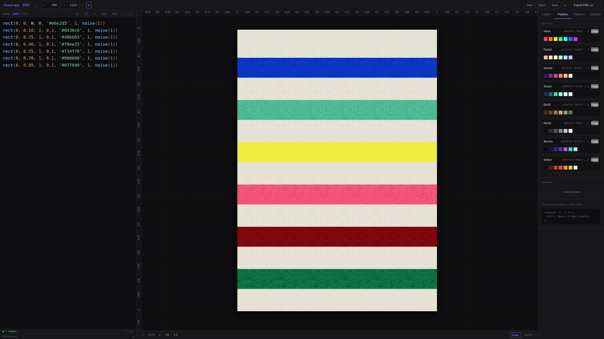
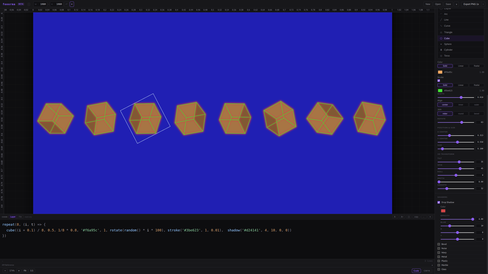
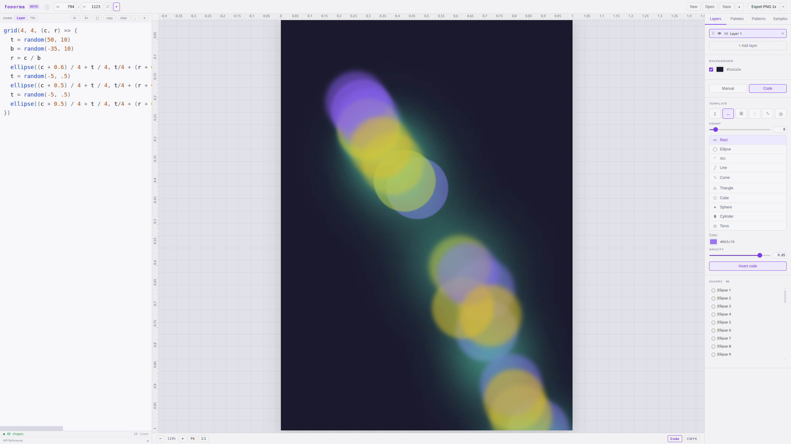
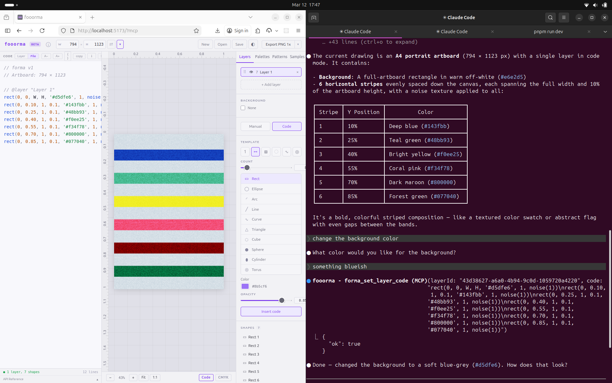

# fooorma

**Procedural Art Studio**

fooorma is a procedural art studio for creating generative designs through code and manual tools. Build layered compositions using a visual query language, tile systems, stamps, palettes, and real-time preview.











## Features

- **Layer system** with manual and code modes
- **Shape primitives**: rect, ellipse, triangle, arc, line, curve, spline
- **3D shapes**: cube, sphere, cylinder, torus with materials (metal, plastic, marble, glass)
- **Tile system** with square auto-tiles and explicit grids
- **Stamp system** for reusable shape groups
- **Custom palettes** and built-in color sets
- **Effects**: shadow, blur, bevel, noise, warp
- **Gradients**: linear and radial
- **Transform system**: rotate, scale, skew, 3D rotations
- **Mask system**: clip content to arbitrary shape alpha
- **Code editor** with syntax highlighting and autocomplete
- **Export** to PNG and CMYK TIFF
- **CMYK soft-proof** preview
- **Project save/load** (.ooo format)
- **MCP server** for AI-assisted manipulation (beta) — see [mcp-server/README.md](mcp-server/README.md)
- **Dark and light themes**
- **PWA support**
- **Desktop app** via Tauri 2 (Linux, macOS, Windows)

## Tech Stack

- **Frontend**: Svelte 5, TypeScript, Vite
- **Desktop**: Tauri 2 (Rust)
- **Package manager**: pnpm

## Getting Started

```bash
pnpm install

# Run as web app
pnpm dev

# Run as desktop app
pnpm tauri:dev
```

## Building

```bash
# Web build
pnpm build

# Native desktop build
pnpm tauri:build
```

## Beta Testing

fooorma is currently in beta. If you'd like to help test it, we'd love your feedback!

- **Report bugs** or **request features** via [GitHub Issues](https://github.com/elenatorro/fooorma/issues)
- **General feedback and questions** via [GitHub Discussions](https://github.com/elenatorro/fooorma/discussions)
- **Reach out directly** at [hola@elenatorro.com](mailto:hola@elenatorro.com)

Any feedback is welcome — whether it's about bugs, missing features, usability, or ideas for new shapes and effects.

## Links

- **Repository**: https://github.com/elenatorro/fooorma
- **Contact**: hola@elenatorro.com

## License

AGPL-3.0-only
